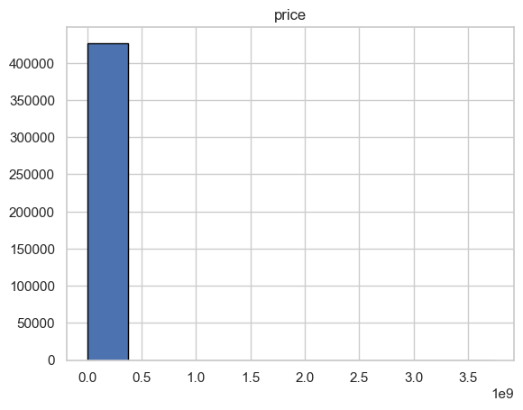
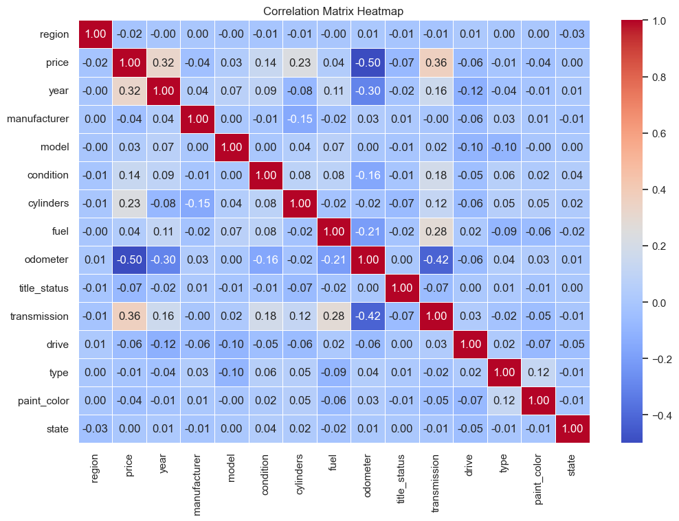

# Car Prices Prediction Model

## Introduction

The dealerships needs to know the value of car prices. We hav a [vehicles](data/vehicles.csv) dataset which can be used to  build models to help the dealerships to estimate prices.

Here is the [jupyter notebook](prompt_II.ipynb) which has all the code for this use case.

## Data Understanding

This dataset has around 426k records which is a good dataset to start with and it has 17 featrures. Lets check the dataset and see how the data and how its quality is.

This dataset has lot of duplicates and null values. Here are few plots which tells the story.

 

Here are few other plots tells the story of the data
 

There are few outliers as well in the target 'price' feature as well. This plot tells that story

See here the histogram of the price 

## Data Cleanup

This data has few features which are not going to impact the model performacne which are *id* and *VIN* so dropped these columns.

One another thing to note that *size* has more that 70% null values so removed this feature as well since it may  not add lot of value in predicting *price* of the car.

Dropped all duplicates values and replaced the nulls with most frequent occurances of the dataset for categorical features and mean for numerical features.

Removed the outliers using inter quartile techniques and here is the plot that tells how the data is distributed after removing outliers

Here are few more plots tells that how the data is distributed after removing nulls.

Once nulls cleaned up , used [LabelEncoder](https://scikit-learn.org/stable/modules/generated/sklearn.preprocessing.LabelEncoder.html) and [TargetEncoder](https://scikit-learn.org/stable/modules/generated/sklearn.preprocessing.TargetEncoder.html) to encode categorocial values.

Here is the correlation martix heatmap after data cleanup.

##  Model Building

Lets go through the model built  out  for this use case.

Built the basic [LinearRegression](https://scikit-learn.org/stable/modules/generated/sklearn.linear_model.LinearRegression.html) model to see how is the base performance without any  fine tuning. It is around **37%** accuracy.

After this improved the model performance by using [StandardScaler](https://scikit-learn.org/stable/modules/generated/sklearn.preprocessing.StandardScaler.html), [PCA](https://scikit-learn.org/stable/modules/generated/sklearn.decomposition.PCA.html) and [K-Means](https://scikit-learn.org/stable/modules/generated/sklearn.cluster.KMeans.html).

Here is the plot for PCA analysis

Used various model like **LinearRegression, Lasso, Ridge, BayesianRidge,ElasticNet** linear models.

And also used techniques like **SequentialFeatureSelection, PolynomialFeatures** to pick optimal features to improve the model performance.

Evaluated model using cross valiadtion and this plot  tells the  story of it

Finally used sklean **Pipelie** to encapsualte the model steps. And also used **GridSearchCV** to fine tune the hyper parameters.

The  following plot  tells that how each model performed against train and test datasets.

## Deployment
Build a model artifact using  joblib library of sklearn and here is the final artifact [model](car_price_prediction_pipeline.joblib)

We can deploy  this model in cloud/on-prem servers and publish this model for end user uses.

## Conclusion
Few things to take care of for better model performance.

1. Make sure have a quality dataset
2. Evaluate other Logistic Regression models 
3. Maybe have a dataset with many  millions of records

